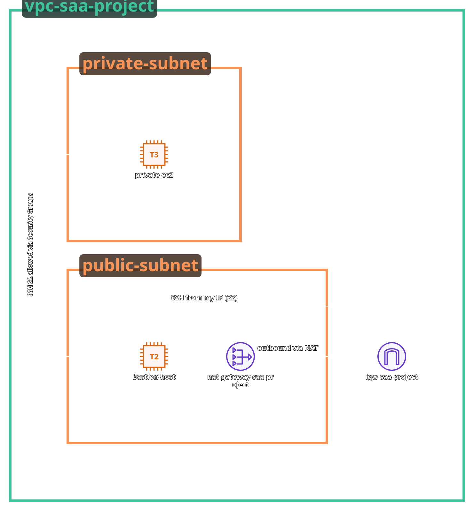

# Secure AWS VPC with Bastion Host and Private Subnets (Production-Ready Architecture)

## Quick Start (Deploy in 5 Minutes)

### Prerequisites
- AWS Account with credentials configured: `aws configure`
- Terraform installed: `terraform version`
- An EC2 key pair in your AWS account (or create one: `aws ec2 create-key-pair --key-name my-key --query 'KeyMaterial' --output text > my-key.pem`)

### Deploy
```bash
cd terraform

# 1. Copy the example configuration
cp terraform.tfvars.example terraform.tfvars

# 2. Edit terraform.tfvars with your settings
# IMPORTANT: Update key_pair_name to match your AWS key pair name
nano terraform.tfvars

# 3. Initialize, plan, and deploy
terraform init
terraform plan -out=plan.tfplan
terraform apply plan.tfplan

# 4. Get your outputs
terraform output
```

### Access Your Instances
```bash
# SSH to bastion (public instance)
ssh -i /path/to/your-key.pem ec2-user@<bastion_public_ip>

# From bastion, SSH to private instance
ssh -i /path/to/your-key.pem ec2-user@<private_instance_ip>

# Or use AWS Systems Manager Session Manager (no key needed!)
aws ssm start-session --target <private_instance_id>
```

### Assuming the `project-deployer` role (recommended)

This repository creates a Terraform-managed role called `project-deployer` that users can assume to get scoped SSM session permissions.

1) Get the role ARN from Terraform outputs:

```bash
terraform output deployer_role_arn
# Example output: arn:aws:iam::123456789012:role/project-deployer
```

2) Option A — Temporarily assume the role with STS and export credentials:

```bash
aws sts assume-role --role-arn arn:aws:iam::ACCOUNT_ID:role/project-deployer --role-session-name me-session
# Copy the returned AccessKeyId/SecretAccessKey/SessionToken into environment variables
export AWS_ACCESS_KEY_ID=...
export AWS_SECRET_ACCESS_KEY=...
export AWS_SESSION_TOKEN=...

# Start an SSM session
aws ssm start-session --target <instance-id>
```

3) Option B — Configure a profile that assumes the role (recommended for repeated use):

Add to `~/.aws/config`:

```
[profile project-deployer]
role_arn = arn:aws:iam::ACCOUNT_ID:role/project-deployer
source_profile = default
```

Then run:

```bash
aws ssm start-session --profile project-deployer --target <instance-id>
```

Notes:
- The `project-deployer` role allows starting SSM sessions and describing instances in this account. Your IAM user still needs the ability to assume the role (configured by your AWS administrator) or you must have credentials that can assume it.
- To find instance IDs quickly: `terraform output private_instance_id` or `terraform output bastion_instance_id`.


### Cleanup
```bash
# Destroy all resources when done
terraform destroy -auto-approve
```

---

## Overview

I designed and deployed a production-grade AWS network architecture featuring a fully isolated VPC with public and private subnets, a hardened bastion host, a private EC2 instance, and an optional NAT Gateway for secure outbound traffic. This setup mirrors real-world designs used by companies to protect internal resources while maintaining controlled administrative access.

## Architecture Diagram



The architecture includes:
- **VPC** (CIDR: 10.0.0.0/16)
- **Public Subnet** (10.0.1.0/24) - Contains Bastion Host and NAT Gateway
- **Private Subnet** (10.0.2.0/24) - Contains Private EC2 Instance
- **Internet Gateway** - Attached to VPC for public internet access
- **NAT Gateway** - Enables controlled outbound internet access from private subnet
- **Bastion Host** - Hardened jump server in public subnet
- **Private EC2 Instance** - Application server in private subnet
- **Route Tables** - Separate routing for public and private subnets
- **Security Groups** - Least-privilege access rules

**SSH Flow**: Mac → Bastion (34.205.50.56) → Private EC2 (10.0.2.10)

## Features / What You Implemented

### Networking

* Custom VPC with separate public/private subnets
* Internet Gateway attached to VPC
* NAT Gateway to enable controlled outbound internet access from private resources
* Custom route tables to isolate traffic flows

### Security

* Locked-down SSH access restricted to my IP only
* Bastion host used as a jump server
* Private instance accessible *only* from the bastion
* No public IP on the private instance
* Security groups with least-privilege inbound/outbound rules

### Access Architecture

* SSH into bastion using a key pair
* SSH from bastion → private EC2 using the forwarded key
* Disabled / prevented key pair access on private instance (copy-only)

### Validation / Testing

* Verified private instance is unreachable from the internet
* Confirmed outbound traffic routing through NAT Gateway
* Ran nmap scans to ensure no unintended open ports
* Confirmed IAM, SG, and routing rules behave as designed

## Step-by-Step Documentation

### Step 1 — Create VPC

* VPC CIDR: 10.0.0.0/16
* Enable DNS hostnames and DNS support
* Create VPC with appropriate tags

### Step 2 — Subnets

* **Public Subnet**: 10.0.1.0/24
  * Availability Zone: us-east-1a (or your preferred AZ)
  * Auto-assign IPv4 enabled
  * Map public IP on launch: Enabled
  
* **Private Subnet**: 10.0.2.0/24
  * Availability Zone: us-east-1a (or your preferred AZ)
  * Auto-assign IPv4 disabled
  * Map public IP on launch: Disabled

### Step 3 — Internet Gateway + NAT

* Create and attach Internet Gateway to VPC
* Allocate Elastic IP for NAT Gateway
* Create NAT Gateway in public subnet
* Associate Elastic IP with NAT Gateway
* Create route table for private subnet with route: 0.0.0.0/0 → NAT Gateway

### Step 4 — Route Tables

* **Public Route Table**:
  * Route: 10.0.0.0/16 → local
  * Route: 0.0.0.0/0 → Internet Gateway
  * Associate with public subnet

* **Private Route Table**:
  * Route: 10.0.0.0/16 → local
  * Route: 0.0.0.0/0 → NAT Gateway
  * Associate with private subnet

### Step 5 — EC2 Instances

* **Bastion Host**:
  * AMI: Amazon Linux 2023
  * Instance Type: t3.micro
  * Subnet: Public Subnet (10.0.1.0/24)
  * Public IP: Auto-assigned
  * Key Pair: Your SSH key pair

* **Private EC2 Instance**:
  * AMI: Amazon Linux 2023
  * Instance Type: t3.micro
  * Subnet: Private Subnet (10.0.2.0/24)
  * Public IP: None
  * Key Pair: Same SSH key pair (for SSH forwarding)

### Step 6 — Security Groups

* **Bastion Security Group**:
  * Inbound: SSH (22) from your IP address only
  * Outbound: All traffic (0.0.0.0/0)

* **Private EC2 Security Group**:
  * Inbound: SSH (22) from Bastion Security Group only
  * Outbound: All traffic (0.0.0.0/0)

### Step 7 — SSH Flow

```bash
# Step 1: SSH into Bastion
ssh -i saa-project1.pem ec2-user@34.205.50.56

# Step 2: From Bastion, SSH into Private EC2
ssh -i saa-project1.pem ec2-user@10.0.2.10

# # Alternative: SSH with agent forwarding (if configured)
# ssh -A -i saa-project1.pem ec2-user@34.205.50.56
# ssh ec2-user@10.0.2.10
# ```

### Step 8 — Verification

* **Test Private Instance Isolation**:
  ```bash
  # From your local machine - should fail
  ssh -i saa-project1.pem ec2-user@10.0.2.10
  # Connection should timeout or be refused
  ```

* **Test NAT Gateway Functionality**:
  ```bash
  # From private EC2 instance
  curl https://api.ipify.org
  # Should return the NAT Gateway's public IP
  ```

* **Network Scanning**:
  ```bash
  # From your local machine
  nmap -p 22 10.0.2.10
  # Should show port 22 as filtered/closed
  ```

* **Traceroute Verification**:
  ```bash
  # From private EC2 instance
  traceroute 8.8.8.8
  # Should route through NAT Gateway
  ```

## Code

This project includes infrastructure-as-code implementations:

* **Terraform** - See `terraform/` directory
* **CloudFormation** - See `cloudformation/` directory
* **Bash Scripts** - See `scripts/` directory

### Prerequisites

* AWS CLI configured with appropriate credentials
* Terraform >= 1.0 (for Terraform deployment)
* SSH key pair created in AWS

**New to Terraform?** See [TERRAFORM_SETUP.md](TERRAFORM_SETUP.md) for detailed setup instructions.

### Deployment

#### Using Terraform

**Quick Start:**
```bash
cd terraform
cp terraform.tfvars.example terraform.tfvars
# Edit terraform.tfvars and set your key_pair_name
terraform init
terraform plan
terraform apply
```

**One-Click Deploy (with auto-SSH):**
```bash
./scripts/terraform-one-click.sh
```

Terraform will:
- Create VPC, subnets, NAT Gateway, Internet Gateway
- Launch bastion host and private EC2 instance
- Configure security groups and route tables
- Output SSH commands to connect

**Get connection info after deployment:**
```bash
cd terraform
terraform output
```

#### Using CloudFormation

```bash
aws cloudformation create-stack \
  --stack-name vpc-bastion-nat \
  --template-body file://cloudformation/vpc-bastion-nat.yaml \
  --parameters ParameterKey=MyIP,ParameterValue=<your-ip>/32 \
               ParameterKey=KeyPairName,ParameterValue=<your-key-pair>
```

## Results / What You Learned

I learned how real AWS production networks are segmented, how least-privilege access works through security groups, and how to use a bastion host to protect private resources. I validated routing behavior, SG enforcement, and the NAT gateway's effect on outbound internet traffic. This is the foundational network pattern used in nearly every modern AWS deployment.

Key takeaways:
- **Network Segmentation**: Understanding how public and private subnets isolate traffic
- **Security Groups**: Implementing least-privilege access patterns
- **Bastion Host Pattern**: Using a jump server for secure administrative access
- **NAT Gateway**: Enabling controlled outbound internet access without exposing private resources
- **Route Tables**: Controlling traffic flow between subnets and external networks
- **Production Patterns**: This architecture mirrors what's used in enterprise AWS environments

## Repository Structure

```
/
├── README.md
├── architecture-diagram.png
├── terraform/
│   ├── main.tf
│   ├── variables.tf
│   ├── outputs.tf
│   └── terraform.tfvars.example
├── cloudformation/
│   └── vpc-bastion-nat.yaml
├── scripts/
│   ├── deploy.sh
│   ├── verify.sh
│   └── terraform-one-click.sh
├── TERRAFORM_SETUP.md
├── screenshots/
│   ├── vpc.png
│   ├── public-rtb.png
│   ├── private-rtb.png
│   ├── bastion-ssh.png
│   ├── private-ssh.png
│   ├── bastion-sg-rules.png
│   ├── private-sg-rules.png
│   └── nat-gateway.png
└── tests/
    ├── curl-results.txt
    ├── nmap-scan.txt
    └── traceroute.txt
```

## Screenshots

Screenshots demonstrating the implementation are available in the `screenshots/` directory:
- VPC configuration
- Route tables
- Security groups
- SSH access flow

## Testing Results

Test results and validation outputs are stored in the `tests/` directory:
- Network connectivity tests
- Security group validation
- NAT Gateway verification
- Port scanning results

